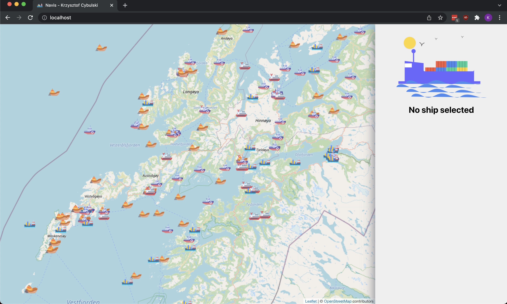
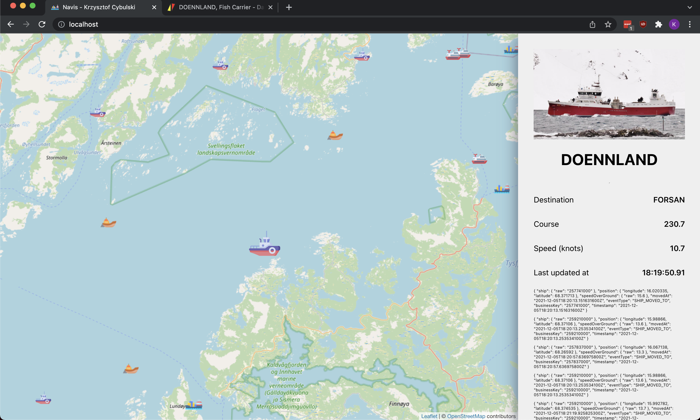

# Navis 🚢

Playground for some technologies. App created for contest organized by [bykowski.pl](https://bykowski.pl/wez-udzial-w-konkursie-programistycznym-monitorowanie-jednostek-morskich/).

## How to run?

Set your API keys for as environment variables. 
You can find information about registration [on wiki](https://wiki.barentswatch.net/display/BO/Application+registration+and+authentication).

```
export BARENTS_WATCH_CLIENT_ID={}
export BARENTS_WATCH_CLIENT_SECRET={}
```

And then start Docker:

> docker-compose up

## About project

**Navis** allows you to track ships in Norway with live positions updates.
It provides real live data from `barents-watch` API and is easily extendable.



As you can see on screenshot below **navis** provide:
* Live ship position (updated via _websocket_)
* Ship name
* Ship image
* Ship destination, course and speed
* Ship event log (in raw format, fetched directly from _event store_)



## Backend

* Modularized with **Gradle**
* Modules in **Kotlin**
* **Spring Web** module in Java
* **Event sourcing** (with in-memory events repository)
* **Reactive** programming and **websockets** to provide live updates
* **Hibernate** with **Postgres** to keep data snapshots
* In-memory cache
* Domain tests in **Groovy**

## Frontend

* **React**
* **Redux** (+ _redux-thunk_)
* **web worker** to update app state in background

## Further development

* Persist events (e.g. in Mongo)
* Add live compass animation
* Add other AIS providers
* Show routes on map
* Format event log
* Integration/acceptance tests

## Author

Krzysztof Cybulski  
krzysztofpcy@gmail.com  
Student at [Warsaw University of Technology](https://www.pw.edu.pl/)
